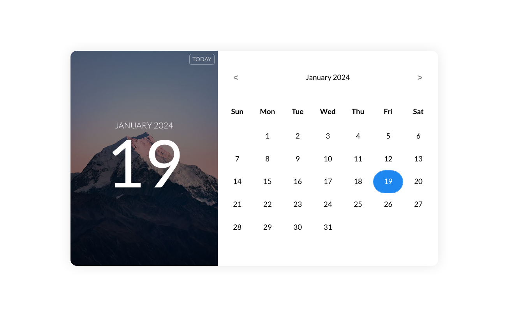

# SimpleCalendar.js

## Overview

This project is my attempt to replicate the free calendar template from Colorlib using pure vanilla JavaScript. The goal is to provide a neat date display that is fully mobile-ready and adapts to different screen sizes.

## Preview

Original template by Colorlib: [Live Preview](https://preview.colorlib.com/theme/bootstrap/calendar-07/)

## Features

- Neat and responsive date display.
- Fully mobile-ready for a seamless user experience.
- No external libraries used, just pure JavaScript.

## Acknowledgments

Thanks to Colorlib for the original inspiration and design.

